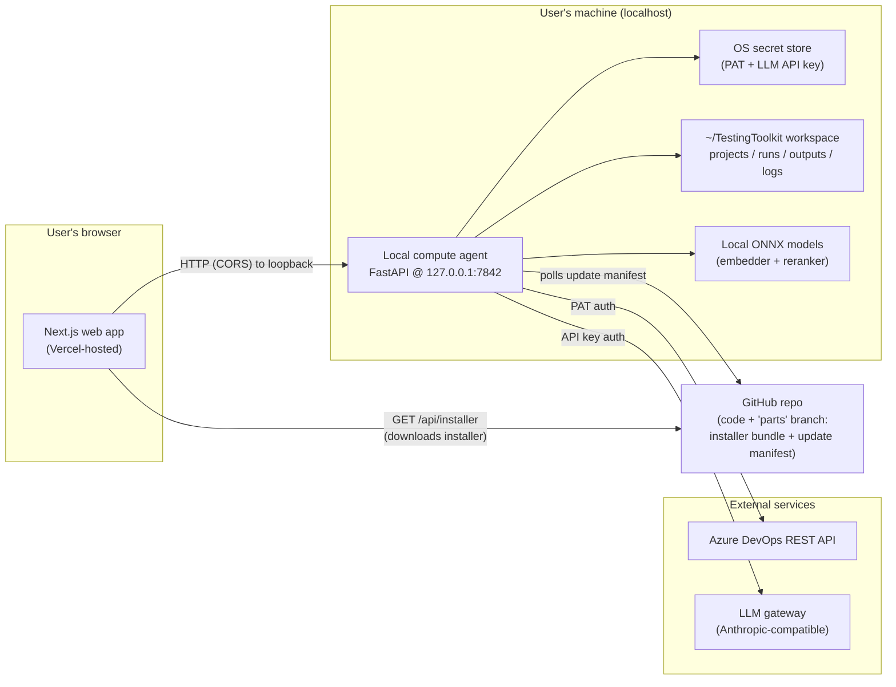
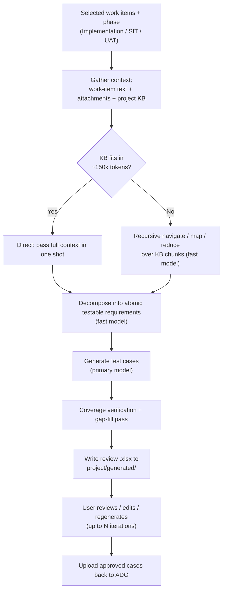
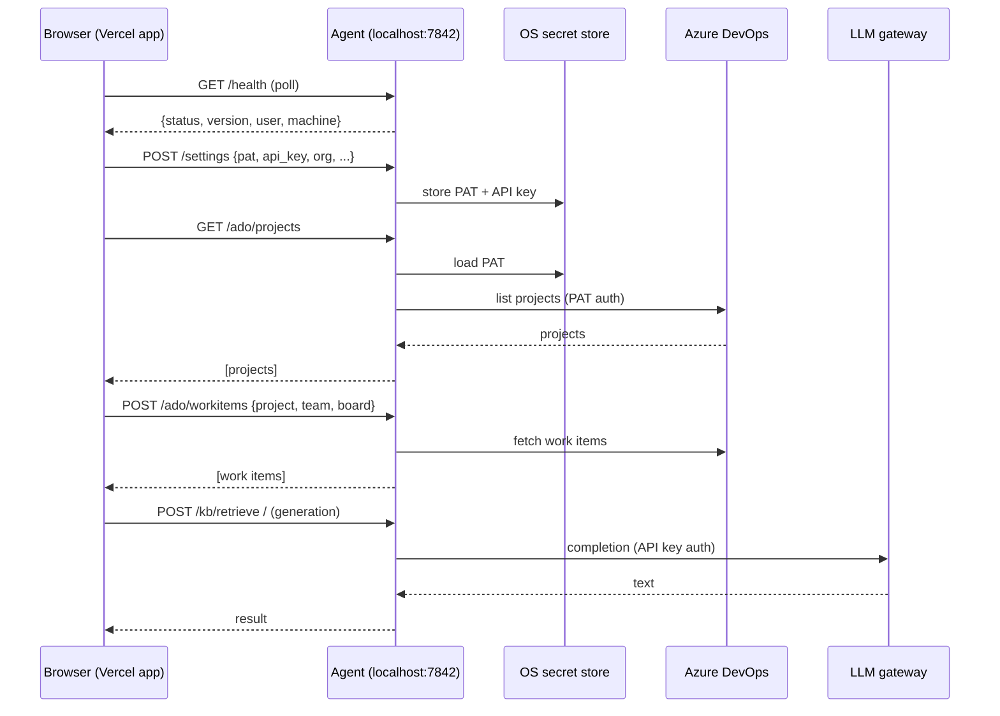
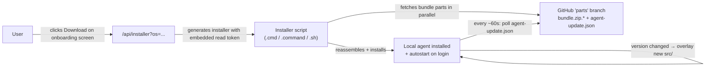

# Testing Toolkit — Architecture

This document describes the end-to-end architecture of the Testing Toolkit: what
problem it solves, how the pieces fit together, and how data and secrets flow
through the system.

---

## 1. The problem it solves

QA engineers working against **Azure DevOps (ADO)** repeatedly perform a set of
manual, time-consuming tasks:

1. Open a board, read through user stories / work items and their attachments.
2. Hand-write test cases for each work item across several phases
   (**Implementation**, **SIT**, **UAT**).
3. Bundle requirement documents and attachments into per-work-item PDF packets.
4. Triage and file bulk defects back into ADO.

The original solution was a **PySide6 desktop application** ("Testing Toolkit")
that automated this with an LLM-backed generation pipeline and a local knowledge
base (KB). It worked, but shipping a desktop GUI has real costs: installers per
OS, update friction, and a heavy Python/Qt footprint on every machine.

**This project is the web re-platforming of that desktop app.** It keeps the
exact same capabilities and data model, but moves the user interface to a
browser app deployed on Vercel — while keeping everything that needs local trust
(secrets, ADO/LLM traffic, local ML models, filesystem) on the user's own
machine via a small **local compute agent**.

---

## 2. High-level shape

The system is split into two cooperating halves plus a distribution channel:



Key property: **the browser never sees a secret and never talks to ADO or the LLM
directly.** The web app only ever calls `http://127.0.0.1:7842` — the agent
running on the same machine. The agent is the only component that holds
credentials and makes authenticated outbound calls.

---

## 3. Components

### 3.1 Web app (`app/`, `components/`, `lib/`)

- **Framework:** Next.js 16 (App Router, React 19), Tailwind CSS v4, deployed on
  Vercel.
- **Entry / gating (`app/page.tsx`):** polls the agent's `/health`. Three states:
  - `connecting` → loading screen
  - `offline` → `OnboardingScreen` (download + run the installer)
  - `connected` → loads settings, then renders the main `AppShell`
- **Central UI state (`lib/app-state.tsx`):** a React context that mirrors the
  desktop `MainWindow` — current project/board, the loaded board view, the
  work-item selection set, the log/progress feed, KB indexing status, and
  nav/dialog visibility.
- **Typed agent client (`lib/agent-client.ts`):** a single typed wrapper around
  `fetch` to `http://127.0.0.1:7842`. All request/response types mirror the
  Python data model (`ado/boards.py`, `testgen/tc_types.py`) so the web GUI is a
  faithful 1:1 of the desktop experience.
- **Layout (`components/layout/`):** `AppShell`, `NavPanel` (projects + boards),
  `StatusBar`, `ActivityBar`.
- **Board workspace (`components/board/`):** `BoardGrid` (swim-lane work-item
  grid), `DetailPane` (work-item detail + generated-output browser), `ActionBar`
  (per-phase actions), `LogPanel`.
- **Dialogs (`components/dialogs/`):** Settings, Generate, Project KB, Defects,
  Upload, Package, Retrieval — each a modal tool, matching the desktop menus.
- **Installer endpoint (`app/api/installer/route.ts`):** the one server-side
  route in the web app. It generates a tiny per-OS installer script
  (`.cmd` / `.command` / `.sh`) with a short-lived GitHub read token embedded at
  download time, so the running installer can pull the bundle parts from the
  `parts` branch without the user needing repo access. See §6.

### 3.2 Local compute agent (`agent-bundle/src/agent/`)

A FastAPI app (`agent/server.py`) bound to `127.0.0.1:7842`. It exists to give
the browser app a trusted local surface for everything that can't happen in the
cloud:

- Holds secrets (PAT, LLM API key) in the OS secret store.
- Calls Azure DevOps and the LLM gateway with those secrets.
- Runs local ONNX models for KB embedding + reranking.
- Reads/writes the local workspace (`~/TestingToolkit`).
- Self-updates from a GitHub-hosted manifest.

On startup (`_lifespan`) it ensures the workspace exists, preloads the ONNX
models in the background, and — if `AGENT_MANIFEST_URL` is set — starts the
auto-update loop. CORS is wide open (`*`) because the only reachable origin is
the local browser tab; the real trust boundary is the loopback bind.

**Route groups** (see `docs/openapi.yaml` for the full spec):

| Prefix      | File                    | Responsibility |
|-------------|-------------------------|----------------|
| _(none)_    | `routes/health.py`      | `/health`, `/version` liveness/version |
| `/settings` | `routes/settings.py`    | read/write config + secrets |
| `/ado`      | `routes/ado.py`         | verify PAT, list projects/boards, fetch work items |
| `/kb`       | `routes/kb.py`          | upload, index, retrieve, embed, rerank, status |
| `/llm`      | `routes/llm.py`         | completion proxy, list models |

### 3.3 Backend domain modules (`agent-bundle/src/`)

The agent routes are thin; the real logic lives in the ported desktop modules:

- **`ado/`** — Azure DevOps client (`api.py`), board/work-item fetch
  (`boards.py`), attachment/description extraction (`extract.py`), test-case
  creation back into ADO (`testcase_creator.py`).
- **`kb/`** — the knowledge base: chunking + indexing (`indexer.py`,
  `store.py`), BM25 (`bm25.py`), dense vectors (`embeddings.py`,
  `vector_store.py`), cross-encoder reranking (`reranker.py`), hybrid retrieval
  (`retrieval.py`), OCR/multimedia/legacy-doc extraction, and the ONNX
  `model_bundle.py`.
- **`testgen/`** — test-case generation: phase/type definitions (`tc_types.py`),
  the Recursive Language Model pipeline (`rlm.py`), template analysis
  (`template_analyzer.py`), and Excel writers (`testcase_excel.py`).
- **`defects/`** — bulk defect parsing (`parser.py`), review workbook
  (`review_excel.py`), and ADO upload (`ado_uploader.py`).
- **`tools/`** — PDF packaging (`pdf_packager.py`, `combine_pdf.py`) and Office/
  Visio conversion.
- **`core/`** — cross-cutting config and infrastructure: `app_config.py`
  (identity, workspace layout, model defaults, RLM token budgets),
  `settings_store.py`, `pat_store.py` / secret handling, `runtime_config.py`,
  `orchestrator.py` (async extract + package pipeline), `anthropic_client.py`
  (LLM gateway client), logging, and hardware detection.

---

## 4. The generation pipeline (RLM)

Test-case generation is the core value of the product. It uses a **Recursive
Language Model (RLM)** approach so it can handle requirement corpora far larger
than a single context window (`core/app_config.py`, `testgen/rlm.py`):



Three model tiers are configurable (defaults in `app_config.py`):

- **Primary** (`bedrock.anthropic.claude-opus-4-6`) — quality-critical generation.
- **Fast** (`bedrock.anthropic.claude-sonnet-4-6`) — decompose + recursive map steps.
- **Fallback** (`bedrock.anthropic.claude-haiku-4-5`) — used on failure/rate-limit.

> Generation, PDF packaging, and defect upload run through these backend modules.
> The corresponding agent HTTP endpoints are being layered onto the FastAPI
> surface as the web app reaches parity; the authoritative, currently-served API
> is the set documented in `docs/openapi.yaml`.

---

## 5. Data & secret flow



**Secrets never touch the browser or Vercel.** They are written to the OS secret
store by `POST /settings` and read back only inside the agent for outbound calls.
`GET /settings` returns booleans (`has_api_key`, `has_pat`) — never the values.

### Local workspace (`~/TestingToolkit`)

Created on first launch (`core/app_config.py`):

```
~/TestingToolkit/
  projects/<full_project_name>/
    system_prompt.txt        per-project generation prompt
    kb/                       dropped requirement documents
    kb_index.json            cached chunk index
    generated/               payloads + review .xlsx per run
  runs/                      packager work dir
  outputs/                   finished PDF packets
  logs/                      rotating debug log
  settings.json              base url, model, org, prefix (non-secret)
  ui_prefs.json              window/splitter/theme prefs
```

---

## 6. Distribution & auto-update

The desktop-grade backend (Python + ONNX models) is large, so it is **not**
committed to the app branch. Instead it lives split into parts on a dedicated
`parts` branch, together with an update manifest:



- **`app/api/installer/route.ts`** serves a per-OS installer with a
  fine-grained, `contents:read` GitHub token (`BUNDLE_READ_TOKEN`, falling back
  to `GITHUB_TOKEN`) injected at download time. The token is never in the repo or
  client bundle; a human passes SSO to download the file, and the running script
  uses the embedded token to pull the parts.
- **`agent/updater.py`** polls `agent-update.json` on the `parts` branch. When
  the manifest version differs from the running `AGENT_VERSION`, it overlays the
  updated `src/` files — so most updates ship as a lightweight **patch**, not a
  full reinstall. A rebuild of the multi-hundred-MB `bundle.zip` is only needed
  to change the from-scratch install baseline.
- **`scripts/build-agent-update-manifest.mjs`** produces the manifest; it is
  published to the `parts` branch (kept out of the code branch via
  `.gitignore`).

This is why a typical backend change is: bump `AGENT_VERSION`, push source to the
code branch, regenerate `agent-update.json`, and publish it to `parts`. A
web-only change just redeploys on Vercel.

---

## 7. Request lifecycle summary

1. User opens the Vercel app → it polls the local agent's `/health`.
2. If no agent, the onboarding screen offers a one-click installer download; the
   installer pulls the bundle from GitHub and installs the agent with autostart.
3. Once the agent is up, the app loads settings; first-run gate collects ADO org,
   PAT, and LLM API key → `POST /settings` stores secrets locally.
4. User picks a **project** → `GET /ado/projects` / `/ado/boards/{project}`; the
   agent auto-kicks KB indexing for that project.
5. User picks a **board** → work items load into the swim-lane grid; a detail
   pane shows the selected item.
6. User ticks work items and runs a **phase** (Implementation/SIT/UAT) → the RLM
   pipeline (context + KB retrieval + LLM) produces a review `.xlsx`.
7. User reviews/edits/regenerates, then **uploads** approved test cases back into
   ADO; requirement packets can be **packaged** into per-work-item PDFs.
8. Bulk **defects** can be parsed from files and uploaded to ADO.

---

## 8. Technology summary

| Layer            | Technology |
|------------------|------------|
| Web UI           | Next.js 16 (App Router), React 19, Tailwind CSS v4, framer-motion, lucide-react |
| Hosting          | Vercel |
| Local agent      | Python, FastAPI, Uvicorn (loopback `127.0.0.1:7842`) |
| ML (local)       | ONNX Runtime — embedder + cross-encoder reranker |
| Retrieval        | Hybrid BM25 + dense vectors + reranking |
| LLM              | Anthropic-compatible gateway (Bedrock Claude model tiers) |
| Source of truth  | Azure DevOps REST API |
| Secrets          | OS-native secret store (per user, on device) |
| Distribution     | GitHub `parts` branch (split bundle + update manifest) |
